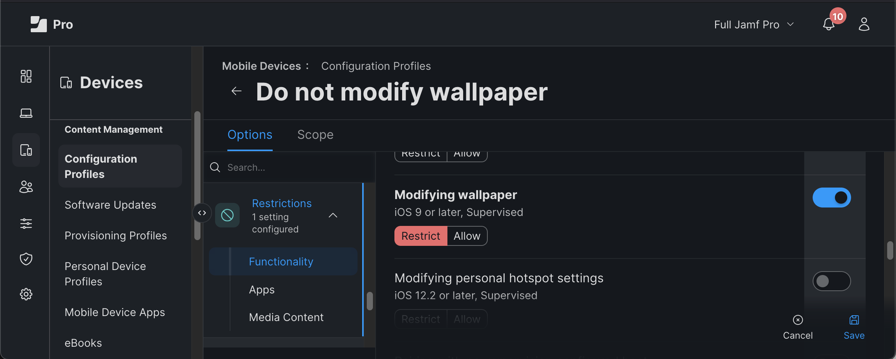

   

# Wallpaper Designer for Jamf Pro

## Introduction

Wallpaper Designer is a macOS app helps you set customized background images on the iOS and iPadOS devices you manage with Jamf Pro. You can overlay custom text and/or a QR Code for each device. 

The Wallpaper application is available for download [here](https://github.com/Jamf-Concepts/wallpaper-designer/releases/latest/download/Wallpaper.zip).

## Background

Jamf Pro includes a feature to set a background image (or "wallpaper") for the Lock Screen and/or Home Screen of managed phones and iPads. 

The Set Wallpaper command is available for devices meeting these requirements:  

* iOS 8 and above (Supervised)
* iPadOS 13.1 and above (Supervised)

Different organizations use this feature in different ways, or not at all. For example, for individually-assigned devices, many administrators prefer to let the users control their own wallpaper. Others -- especially those with shared-use/cart devices in education, retail, or industry settings -- will heavily customize things like background images and home screen icon arrangement so all devices have the same setup. That way their users have a consistent experience on any device. 

In Jamf Pro, Wallpaper may be deployed to a series of devices using the "Action" button available on device listing screens like inventory list, advanced search, or when viewing group membership. A tutorial video is available from [Lesson 15: Advanced Searches and Actions | Jamf 100 Course](https://www.youtube.com/watch?v=ZNJxGaf0s5k). 

Wallpaper deployment can also be configured in a Mobile Device Smart Group's "Automated Management" tab. 

Smart groups allow a lot of flexibility for determining which devices get which image. For example, you could set a special lock-screen image to quickly see which devices have a special set of restrictions when they've been switched to test-taking mode. The set-wallpaper command will be issued any time a device falls into the smart group. The Smart Group automation method also allows you to automatically re-install your desired wallpaper automatically if the device is reset and re-enrolled in Jamf Pro. 

These capabilities will satisfy most needs, but they won't be of much help if you have 1,000 iPads and you want the device's serial number to appear on the Lock Screen of every device. The Wallpaper app will save you the trouble of making 1,000 image files and deploying them by hand. 

&nbsp;

## Notices

### Limitations

You should be aware that wallpaper images are stored in Jamf Pro's database. We've seen customers set wallpaper on many thousands of devices without issue, but don't start off by sending out a customized wallpaper to 100,000 devices at once. It would better to start with a test group, evaluate results, then ramp up from there. You can minimize database size by sending images with a resolution that gives a nice result but doesn't far exceded what the device can actually display. Image processing for a large fleet will take some time and deploying the images will consume server resources. If you have many thousands of devices, talk to us about solutions that will make better sense in your environment. The Wallpaper app is also not a solution if you have a workflow that resets devices between users as wallpapers set by this utility won't automatically come back. Smart group actions and our solutions for setting dynamic the wallpapers on device enrollment would be a better fit in these scenarios. 

### Terms of Use

Wallpaper is offered as a [Jamf Concept](https://concepts.jamf.com/child_pages/about.html) app and is licensed under the terms of the [Concepts Use Agreement](https://resources.jamf.com/documents/jamf-concept-projects-use-agreement.pdf). 

### Sharing Your Feedback

We'd love to hear from you about how we can make the app better. If you have thoughts to share, please feel free to open a discussion or [file an issue](https://github.com/Jamf-Concepts/wallpaper-designer/issues) in the project's GitHub repository. 

&nbsp;

## Setup

### Permissions

The Wallpaper Designer app requires a login for Jamf Pro. When logging in with a username/password check that your user has at least these permissions: 

| Section                  | Permissions                           |
|--------------------------|---------------------------------------|
| Jamf Pro Server Objects  | Mobile Devices: Create, Read, Update  |
| Jamf Pro Server Actions  | Send Mobile Device Set Wallpaper Command |

 

If using an API client/secret:
- Create Mobile Devices
- Read Mobile Devices
- Update Mobile Devices
- Read Buildings
- Read Departments
- Read Sites
- Send Mobile Device Set Wallpaper Command
  

### Optional – Noting wallpaper deployment in an extension attribute

If you want to keep track of which devices have a wallpaper deployed via the app, you can create a mobile device extension attribute. If the attribute exists, Wallpaper will write the current date there any time it deploys a wallpaper to the device. 

In the Jamf Pro console, go to Settings --> Device Management --> Extension Attributes, then click "New" and apply the following settings:

- **Display Name:** "Wallpaper Applied"
- **Data Type:** "Date (YYYY-MM-DD hh:mm:ss)"
- **Inventory Display:** Select whichever page you prefer
- **Input Type:** "Text Field"

&nbsp;

## Startup

When you launch the program, you may be prompted to login to your Jamf Pro Server. If you save your login information to the your macOS user keychain it will be filled in for you any time you run the program. 

## The Preview area

The preview area lets you select an image and define a scannable QR code and/or customizable text, then deploy a finished setup to your devices. 

To set a wallpaper, select an image file (.jpeg or .png format) from the drop-down menu or select a solid color using the color wheel. Your image/color will appear in the preview area. You can swap the preview between iPhone and iPad views using the device icons. 

To the right of the preview area, there are some options for setting overlay content, including a dynamic text box and a QR code. You can drag the QR code and text box within the preview display to set their position. Holding the shift key while dragging will center the object horizontally. 

| Image Sizing Notes |
|--------------------|
| When using a custom image file, the best resolution will depend on the display resolution of your target devices and your image's level of visual detail. iOS devices will automatically size/crop your image to achieve a good fit, maintaining aspect ratio. For the best performance, use the smallest image size that achieves an acceptable appearance. Information about device resolutions is available from sites like [ios-resolution.com](https://www.ios-resolution.com). Wallpaper images rotate with the device on iPad so you may need to add some border to make your image closer to a square if it contains important content near its edges that you don't want to rotate off-screen. |

## Overlay Content Options

You may add text and/or a QR code to the wallpaper and then position them on the screen by moving them within the preview area. 

A dropdown lets you decide what information you want in the QR code to suit your needs. The QR code can resolve to:
-  the serial number of the device
- the URL to the device in Jamf Pro
- some custom text (variables are not supported). 
  

The dynamic text area can be formatted using the formatting dropdown…

The following variables are supported within the text field. These will be replaced with the actual values from each device's Jamf Pro inventory record as Wallpaper is composing the wallpaper image for the device. 

- $devicename
- $serialnumber
- $sitename
- $asset_tag
- $buildingname
- $departmentname
- $room
- $realname
- $email_address

In Jamf Pro, device name, serial number, and often site are populated automatically when a device enrolls. You can populate other values individually in device records, via mass action, or by uploading spreadsheets via [Inventory Preload](https://learn.jamf.com/en-US/bundle/jamf-pro-documentation-current/page/Inventory_Preload.html) or the [MUT utility](https://marketplace.jamf.com/details/the-mut). 

## Deploying the Wallpaper

**Target:** 

You can set the wallpaper on *Lock Screen*, *Home Screen*, or *Both* so you have the option of applying the same or different images on each and/or setting the image for one and not managing the other. 

You can send multiple commands to your devices. For example, you might set a lock screen image that includes a QR code to the Lock Screen, and then send the same image without the QR code to the home screen. 

In a shared-use/cart environment, people often apply their branding to both. For individual-user devices, if either of the wallpapers is managed, it's often just the lock screen. 
  
**Scope:**  

Use the Scope button select the device(s) you wish to target. If you select *Group* or *One Device*, a list of filterable options will appear. For example, you might have a group configured for each school and might want to deploy a different background image to each. Or you might be setting up batches of new devices for classroom carts and have a smart group that shows all the devices that were enrolled that day. 

**The "Set Background" button:** 

The app will send your request to Jamf Pro when you click this button. A dialog summarizing the operation will appear once the app finishes communicating with Jamf Pro. 

Information about the process can be viewed in the app log, available by typing command + L, or from the menu bar, View → Logs Folder.

## Locking the Wallpaper Down

Once a wallpaper is deployed, users can still go into Settings on the device and change it to something else. Some organizations don't mind that. They want to have their wallpaper installed when the device is enrolled, but are happy to let users change it if they want. In other cases, the wallpaper setting needs to be locked in place. To do so, add the "Modifying Wallpaper" restriction to the restrictions payload in a configuration profile. 

## Troubleshooting Notes

Wallpaper stores some minimal data in ~/Library/Containers/jamfie.wallpaper. If you save your Jamf Pro Server information, it's saved in keychain items that start with "JSK" (Jamf Shared Keychain). Log files are saved to `~/Library/Logs/wallpaper.log`.
