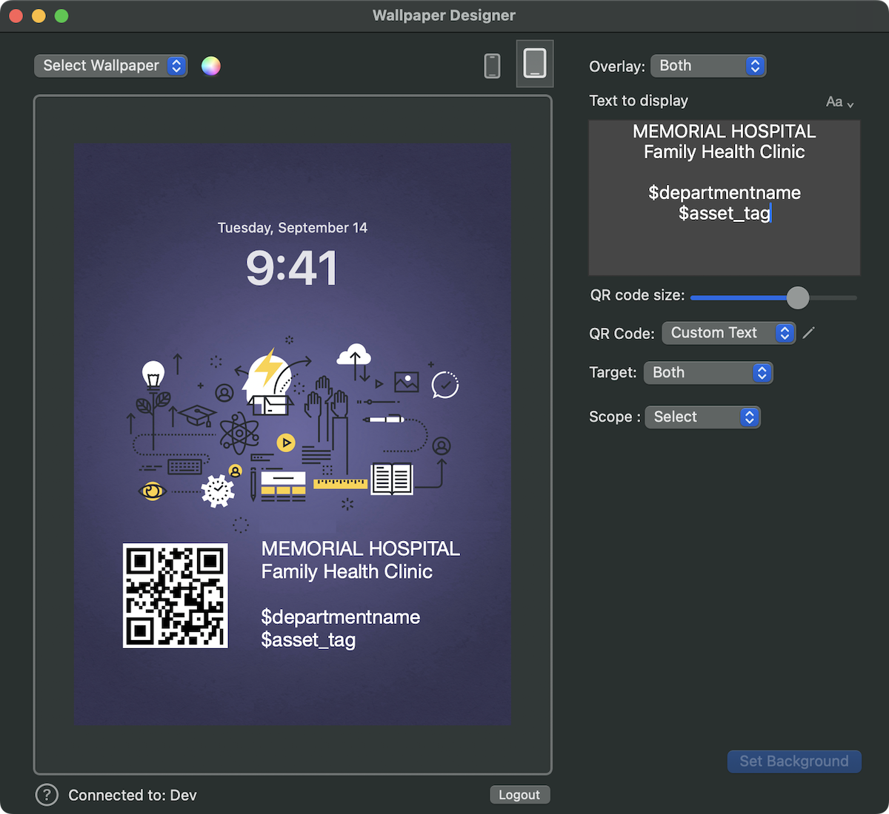
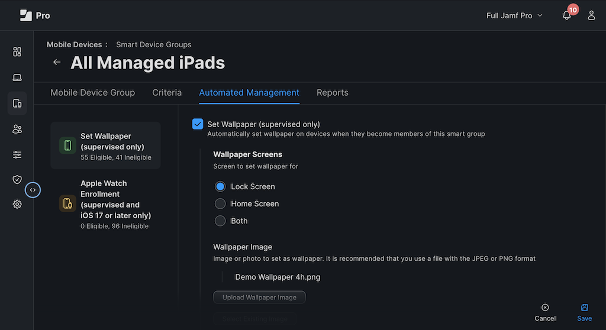
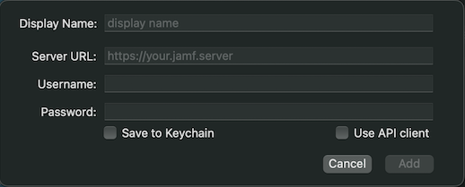
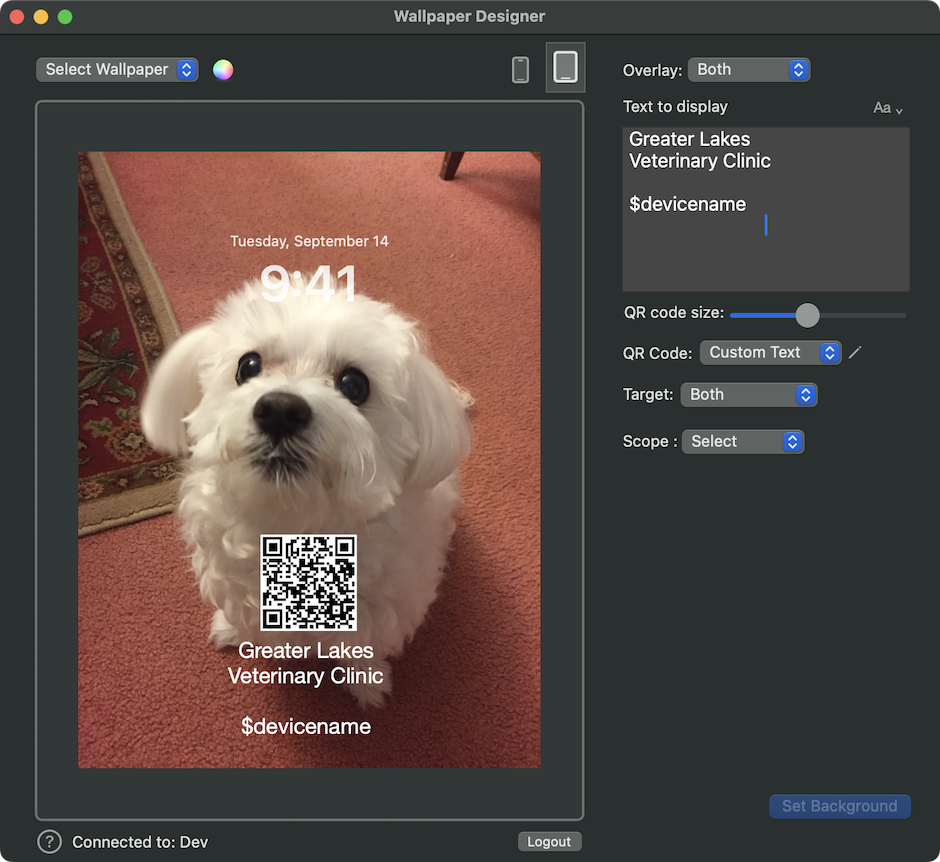
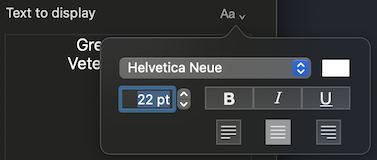
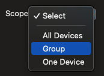

# Wallpaper Designer for Jamf Pro

## Introduction

The Wallpaper app helps you set customized background images on the iOS and iPadOS devices you manage with Jamf Pro. You can overlay custom text and/or a QR Code for each device. 

The Wallpaper application is supplied in a zip file available [here](https://github.com/Jamf-Concepts/wallpaper/releases/latest/download/Wallpaper.zip).
  

## Background

(no pun intended...)

Jamf Pro includes a feature to set a background image (or "wallpaper") for the Lock Screen and/or Home Screen of managed phones and iPads. 

The Set Wallpaper command is available for devices meeting these requirements:  

* iOS 8 and above (Supervised)
* iPadOS 13.1 and above (Supervised)

Different organizations use this feature in different ways, or not at all. For example, many device administrators prefer to let users with individually-assigned devices set them up with whatever look and feel the user enjoys. Others (especially those with shared-use/cart devices in education, retail, or industry settings), will heavily customize things like background images and Home Screen icon arrangement so all devices have a the same setup. That way anyone can pick up any device and have a consistent experience. 

In Jamf Pro, Wallpaper deployment is typically accomplished using the "Action" button available on the mobile device inventory or Advanced Search device listing screens. 

The process can also be automated in a Mobile Device Smart Group's "Automated Management" tab. 

Smart groups allow a lot of flexibility for determining which devices get which image. For example, you could set a special lock-screen image to quickly see which devices have a special set of restrictions when they've been switched to test-taking mode. The set-wallpaper command will be issued any time a device falls into the smart group. In addition, the desired wallpaper will be automatically applied if the device is reset. 

These capabilities will satisfy most needs, but they won't be of much help if you have 1,000 iPads and you want the device's serial number to appear on the Lock Screen of every device. The Wallpaper app will save you the trouble of making 1,000 image files and deploying them by hand. 

## Notices

Please be aware that wallpaper images are stored in Jamf Pro's database. We've seen customers set wallpaper on many thousands of devices without issue, but you should take care not to send out wallpaper to too many devices at once. Avoid constantly re-issuing new wallpaper designs, and don't send images with resolutions that far exceed what a device can actually display. 

Test your setting on a variety of test devices and do your rollouts in phases. Image processing for a large fleet will take some time and deploying the images will consume server resources. 

Wallpaper is offered as a [Jamf Concept](https://concepts.jamf.com/child_pages/about.html) app and is licensed under the terms of the [Concepts Use Agreement](https://resources.jamf.com/documents/jamf-concept-projects-use-agreement.pdf). If you have feedback, please feel free to open a discussion or [file an issue](https://github.com/Jamf-Concepts/wallpaper-designer/issues). 

## Setup

### Permissions

Check that the user you'll use to login to the Wallpaper app has at least these permissions:

| Section                  | Permissions                           |
|--------------------------|---------------------------------------|
| Jamf Pro Server Objects  | Mobile Devices: Create, Read, Update  |
| Jamf Pro Server Actions  | Send Mobile Device Set Wallpaper Command |

### Optional – Noting wallpaper deployment in an extension attribute

To help keep track which devices have had a wallpaper deployed (and which haven't), you can create a mobile device extension attribute. If the attribute exists, Wallpaper will write the current date there any time it deploys a wallpaper to the device. 

Go to Settings --> Device Management --> Extension Attributes, then click New and apply the following settings:

- **Display Name:** Wallpaper Applied
- **Data Type:** Date (YYYY-MM-DD hh:mm:ss)
- **Inventory Display:** Select whichever is you preference
- **Input Type:** Text Field

## Startup

When you launch the program, you will be prompted to login to your Jamf Pro Server. If you save your login information to the your macOS user keychain it will be filled in for you any time you run the program. 

## The Preview area

To set a wallpaper, select an image file (.jpeg or .png format) from the drop-down menu or select a solid color using the color wheel. Your image/color will appear in the preview area. You can swap the preview between iPhone and iPad views using the icons to the right. 

To the right of the preview, there are some options for setting overlay content, including a dynamic text box and a QR code. You can drag the QR code and text box within the preview display to set their position. Holding the shift key while dragging will center the object horizontally. 

| Image sizing notes: |
|---------------------|
| When using a custom image file, the best resolution will depend on the display resolution of your target devices and your image's level of visual detail. iOS devices will automatically size/crop the image to achieve a good fit, maintaining aspect ratio. Use the smallest image size that achieves acceptable appearance to improve performance. Information about device aspect ratios and resolutions is available from sites like [ios-resolution.com](https://www.ios-resolution.com). Wallpaper image rotate with the device on iPad so you may need to add some border to make your image closer to a square if it contains content near its edges that you don't want to rotate off screen. |

## Overlay Content Options

You may add text and/or a QR code to the wallpaper and then position them by moving them in the preview area. 

At present, the QR code will only contain the serial number of the device and can't be customized. 

The dynamic text area can be formatted using the formatting dropdown…

The following variables are supported within the text field. These will be replaced with the actual values from each device's  Jamf Pro inventory record  as Wallpaper is composing its wallpaper image. 

- $devicename
- $serialnumber
- $sitename
- $asset_tag
- $buildingname
- $departmentname

## Deploying the Wallpaper

**Target:** 

You can set the wallpaper on *Lock Screen*, *Home Screen*, or *Both* so you have the option of applying the same or different images on each and/or setting the image for one and not managing the other. 

You can send multiple commands to your devices. For example, you might set a lock screen image that includes a QR code to the Lock Screen, and then send the same image without the QR code to the home screen. 

In a shared-use/cart environment, people often apply their branding to both. For individual-user devices, if any of the wallpapers is managed, it's usually just the Lock Screen. 
  
**Scope:**  

Use the Scope button select the device(s) you wish to target. If you select *Group* or *One Device*, a list of filterable options will appear. 

**The "Set Background" button:** 
The app will send your request to Jamf Pro when you click this button. A dialog summarizing the operation will appear once the app finishes communicating with Jamf Pro. 

Information about the process can be viewed in the app log, available by typing command + L, or from the menu bar, View → Logs Folder.
